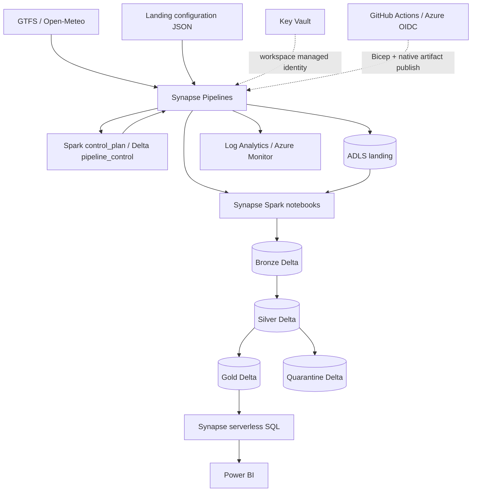

# Synapse-only processing and orchestration

```mermaid
flowchart TB
  Feeds[GTFS / Open-Meteo] --> P[Synapse Pipelines]
  Config[Landing configuration JSON] --> P
  P --> CP[Spark control_plan / Delta pipeline_control]
  CP --> P
  KV[Key Vault] -. workspace managed identity .-> P
  P --> L[(ADLS landing)]
  P --> Spark[Synapse Spark notebooks]
  L --> Spark
  Spark --> B[(Bronze Delta)]
  B --> S[(Silver Delta)]
  S --> G[(Gold Delta)]
  S --> Q[(Quarantine Delta)]
  G --> SQL[Synapse serverless SQL]
  SQL --> BI[Power BI]
  P --> M[Log Analytics / Azure Monitor]
  CI[GitHub Actions / Azure OIDC] -. Bicep + native artifact publish .-> P
```
